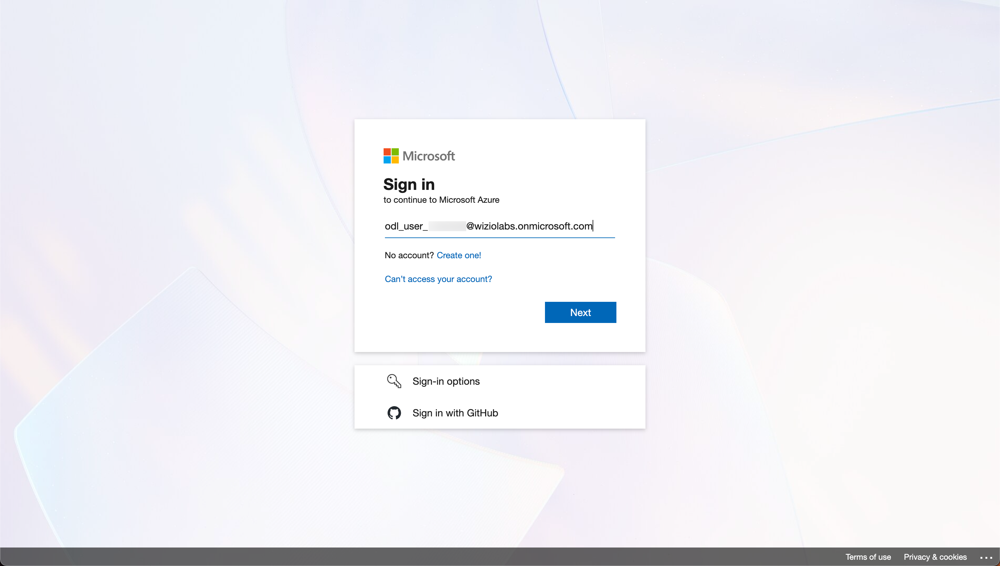
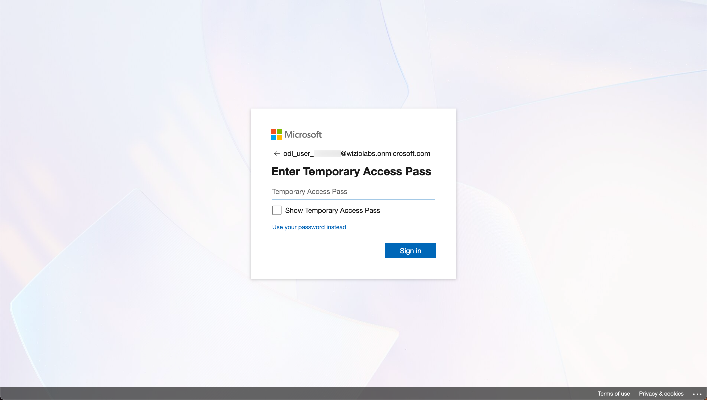
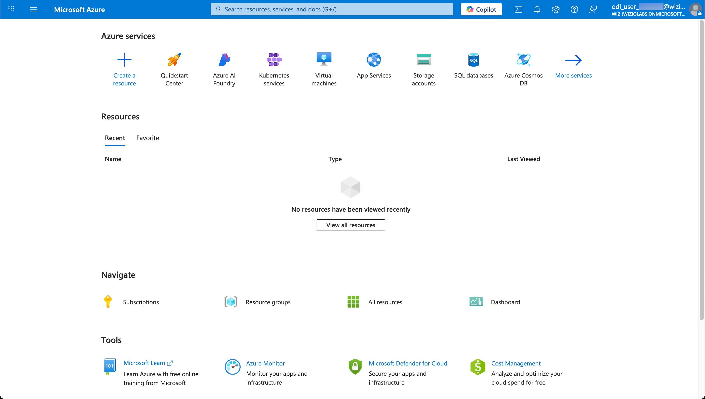

# Accessing the Lab Environment

In this lab, you are granted access to an Azure Subscription and a Wiz Tenant. Use the following steps to sign in to each account and verify that you have proper access.

## Sign in to the Azure portal

1. Open a new private browsing or incognito window in your web browser.

    <aside class="tip">Using a private browsing session ensures that any other Azure portal sessions that you might have cached do not interfere with the lab and vice versa.</aside>

2. In the private browsing window, navigate to the following URL: <inject value="https://portal.azure.com/" enableCopy="true" />.

3. On the **Sign in** page, enter the following username: <inject key="Username" enableCopy="true" />.

    

4. Click **Next**.

5. On the **Enter Temporary Access Pass** page, enter the following **Temporary Access Pass**: <inject key="Username" enableCopy="true" />.

    

7. Click **Sign in**.

8. If you see a **Stay signed in?** page, click **No**.

    You should now be signed in to the Azure portal.

    

